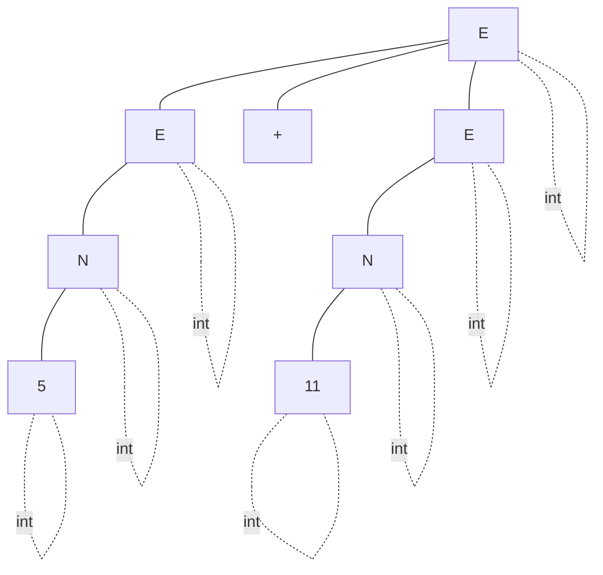
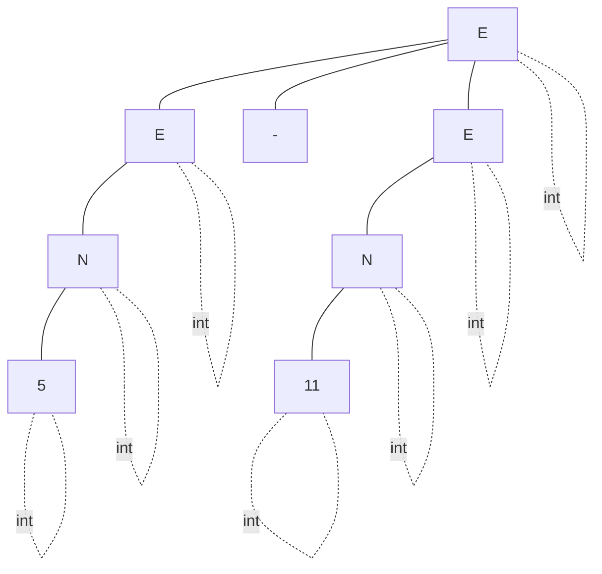
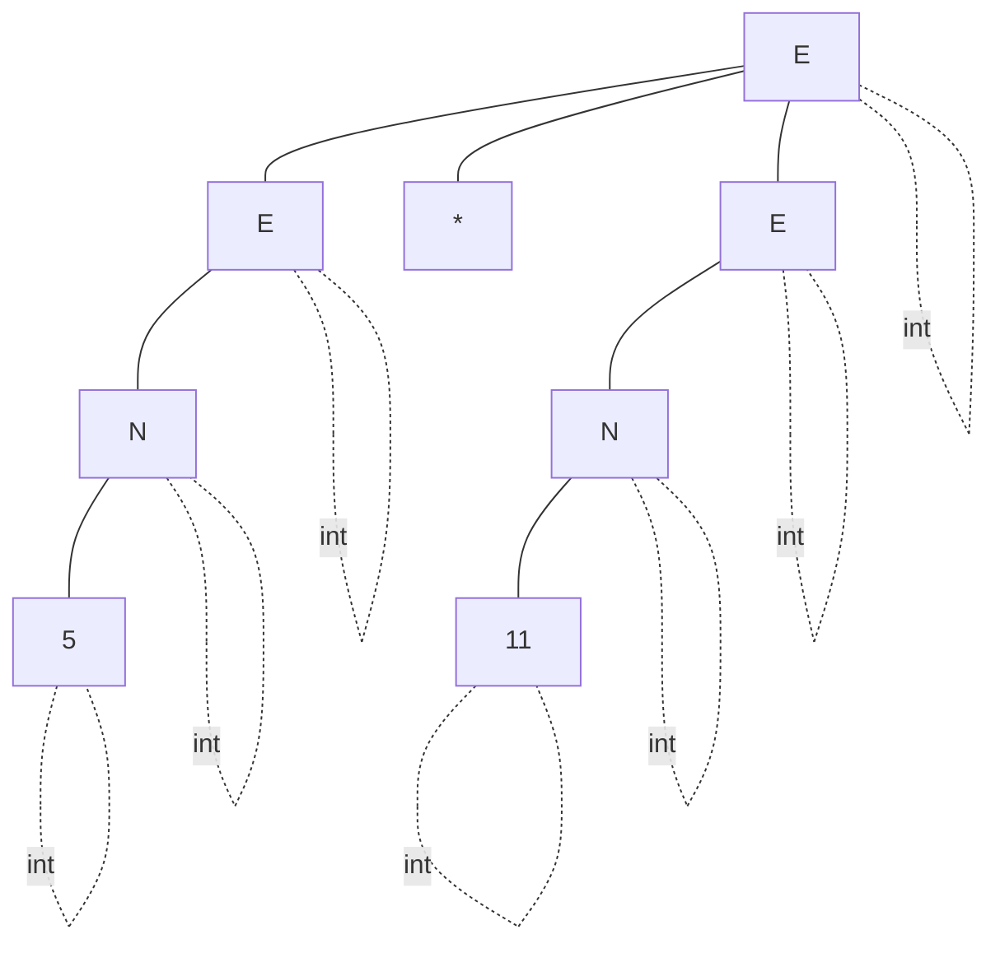
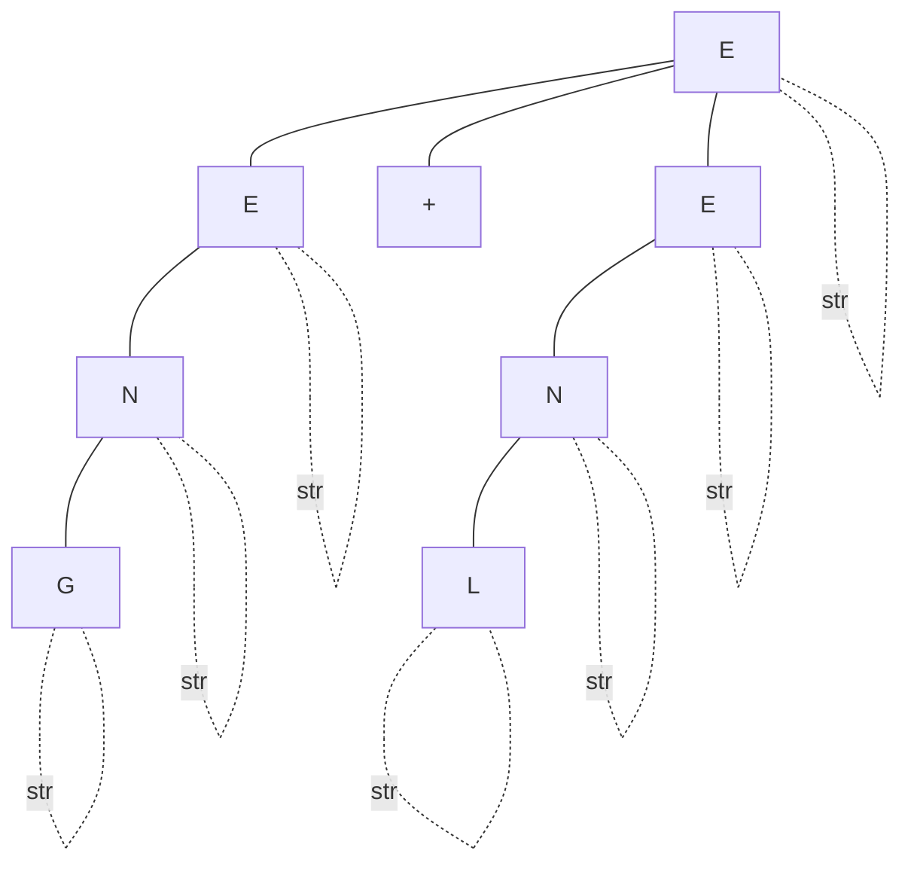
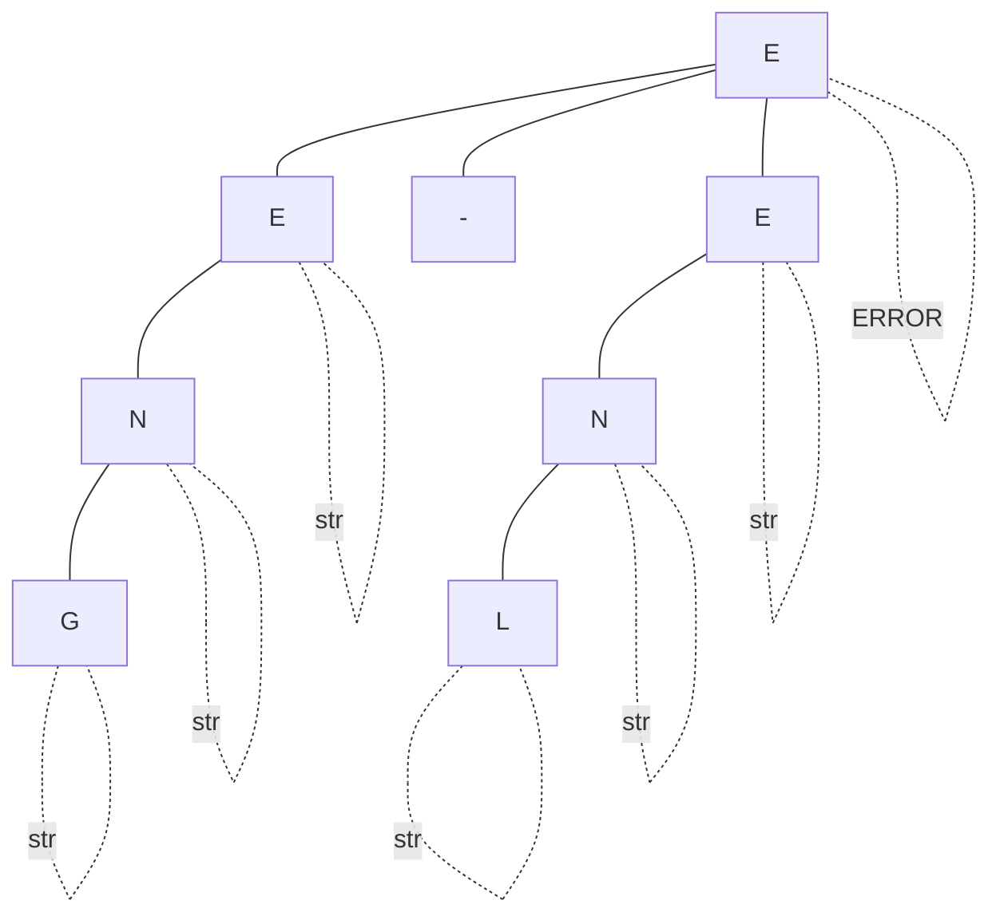
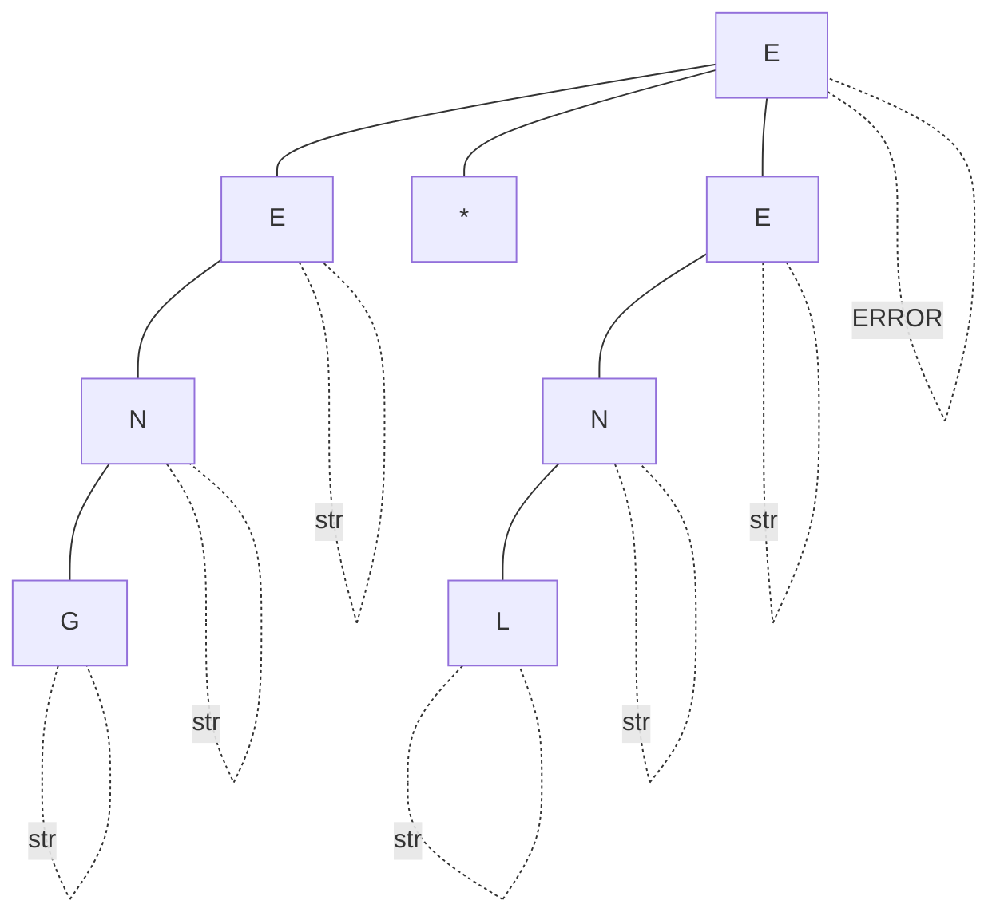
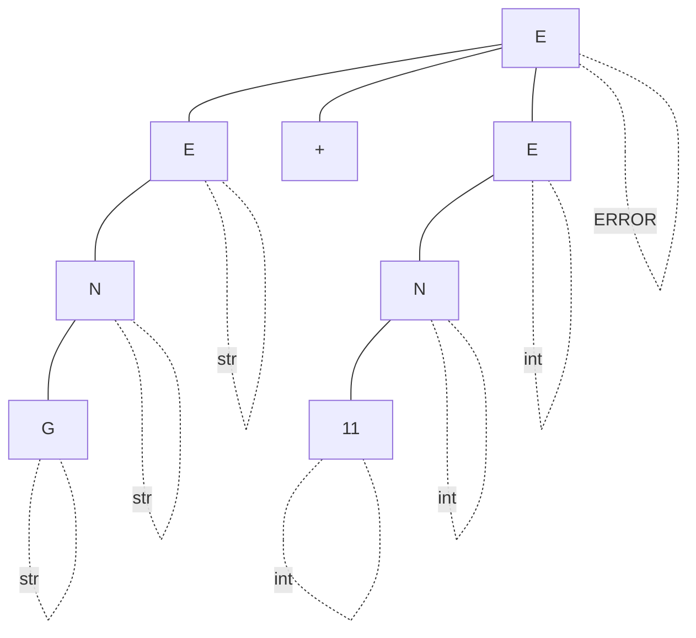
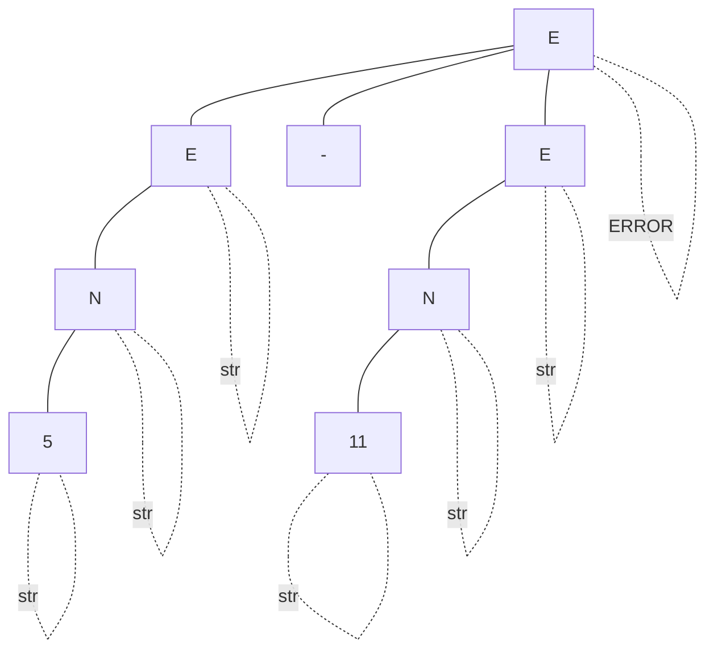
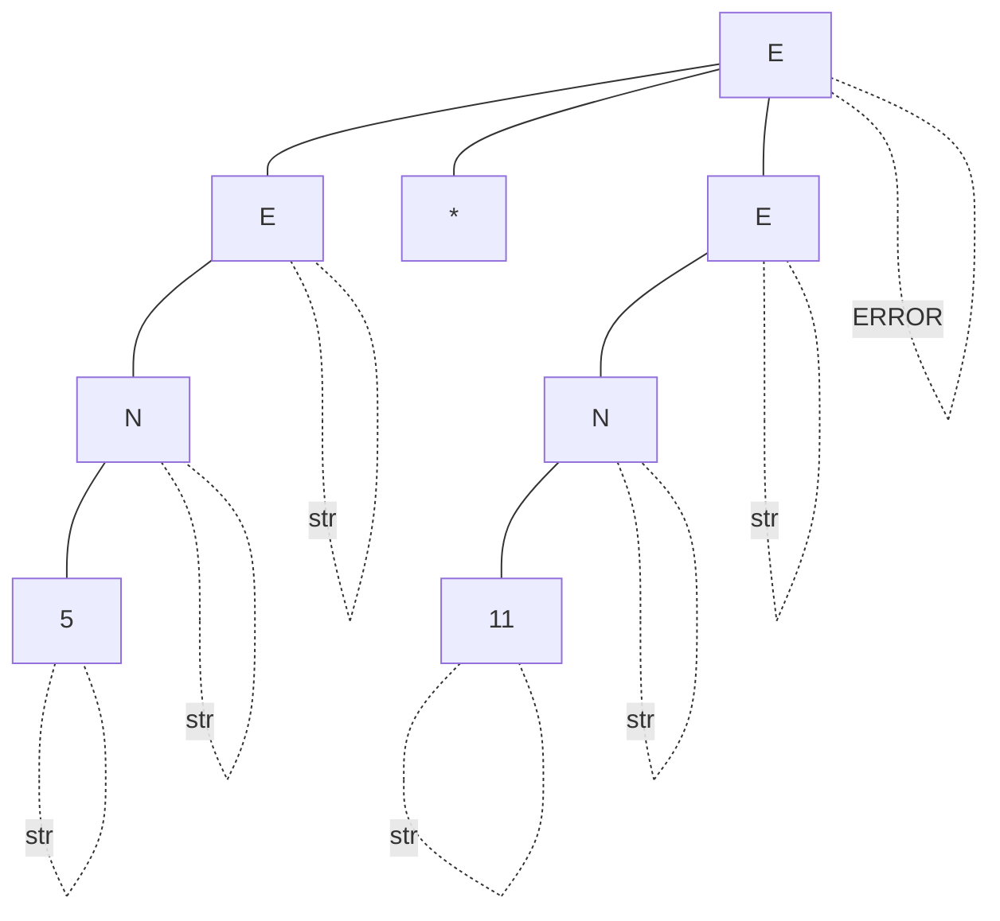

# Sistema de Tipos
Ø (): (En cualquier ámbito, en el ámbito global) 
Γ (Gamma): ambito (En un ámbito en particular) 
⊢ (Trinquete): a la derecha del trinquete es estrictamente verdadero  

Γ ⊢ M : A   
M: Variable   
A: Tipo de dato     

En el ambito gamma es estrictamente verdadero que la variable M es de tipo A.  

## Tipos de datos
## Reglas de ámbito

## Reglas de tipos
### Operaciones entre int

$$
Γ ⊢ a: int \\
{Γ ⊢ b: int \over a + b: int}
$$

$$
Γ ⊢ a: int \\
{Γ ⊢ b: int \over a - b: int}
$$

$$
Γ ⊢ a: int \\
{Γ ⊢ b: int \over a * b: int}
$$

$$
Γ ⊢ a: int \\
{Γ ⊢ b: int \over a / b: int}
$$

 
 

### Operaciones entre string

$$
Γ ⊢ a: str \\
{Γ ⊢ b: str \over a + b: str}
$$

$$
Γ ⊢ a: str \\
{Γ ⊢ b: str \over a - b: ERROR}
$$

$$
Γ ⊢ a: str \\
{Γ ⊢ b: str \over a * b: ERROR}
$$

$$
Γ ⊢ a: str \\
{Γ ⊢ b: str \over a / b: ERROR}
$$

 
 

### Operaciones entre int y string
$$
Γ ⊢ a: str \\
{Γ ⊢ b: int \over a + b: ERROR}
$$

$$
Γ ⊢ a: str \\
{Γ ⊢ b: str \over a - b: ERROR}
$$

$$
Γ ⊢ a: str \\
{Γ ⊢ b: str \over a * b: ERROR}
$$

$$
Γ ⊢ a: str \\
{Γ ⊢ b: str \over a / b: ERROR}
$$

Tipos de datos (int, bool, char, etc y sus posibles valores)

Reglas de ambito (Estatico o dinamico)
Ámbito estático
Reglas de tipos

